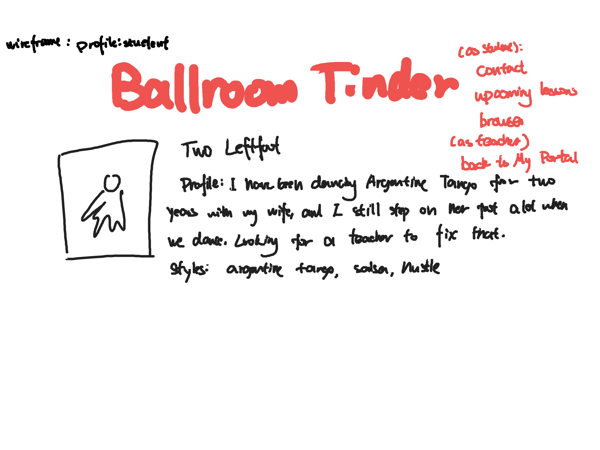

# Ballroom Tinder 

## Overview

Ballroom dancing is a difficult sport to start off because it's hard to schedule lessons with teachers and it is hard to know which teachers is good for you. There is no other way to schedule lessons besides hearing about teachers by word of mouth, getting their numbers and texting them. Even for people who have been doing ballroom for many years, scheduling still takes up a lot of their time because texting requires going back and forth between you, your teacher and your dance partner. Unless...

Ballroom Tinder is a web app that allows teachers and students to get to know each other and make plans together. When users register to the app, they have a choice to register as a teacher or a student. Both teachers and students get to build their portfolio indicating their background, their level of experience, their preferences, and the style that they want to teach/learn, which can be filtered. Additionally, teachers get to mark out days and hours in the week when they are availiable for lessons. (if they are already booked or have other commitments for certain days, that part of their availiability would be marked off) Students get to book teachers on their calendars for the teachers to confirm. The website will remember which teachers and students that the users have had lessons with before, so they can schedule again easily and perhaps schedule standing lessons at the same time each week. If time allows, there will also be a chat box so that teachers and students can communicate about lesson scheduling.


## Data Model

The application will store Student and Teacher Entries:

* Both have:
  - username
  - hash
  - headshot (profile photo as a link)
  - profile
  - styles (not required for students because that's not being filtered and they might not know which style they want to try, for reference only)
  - contact (people that they have taken lessons from or have scheduled/attempted to schedule lessons with, along with how many lessons you have scheduled)
  - upcoming lessons: 
   1. lesson ID also keeps track of how many lessons you've had with teacher/student, can possibily be parsed to show the # of lessons in contacts
   2. teachers can only view profile of students in the contact list for anti-promotion reasons
   3. stored as cookies and set expiration date

* Teacher only:
  -  availiability (ideally implement Google Calendar, if not will show up as radio buttons for the week as availiability)
  - price
  - portfolio (not required but recommended for self-promotion)
  - height (not required, but for teachers to disclaim if they have non-common heights)


An Example Student User:

```javascript
{
  username: "Two Leftfoot",

  headshot: "bloody_shoe.jpg",

  hash: "saveMeFromMyWife",// a password hash,

  profile: "I have been dancing Argentine Tango for two years with my wife, and I still step on her foot a lot when we dance. Looking for a teacher to fix that",
  styles: ["argentine tango", "salsa", "hustle"],
  upcoming lessons: [
        time: "Monday, May 13th, 2020, 3:15p.m. ~ 4:00 p.m.",
        lesson_id: "twoleftfootfredastaire3",
        location: "Stepping Out Studios", 
        student: "Two Leftfoot",
        number_of_students: 2,
        style: "argentine tango"];
  contact: [{name:"Fred Astaire",lessons:3}];
}
```

An Example Teacher User:

```javascript
{  username: "Fred Astaire",
  
  headshot: "me.jpg",

  hash: "oldFreddie",// a password hash,

  profile: "Born in 1899, died in 1987, my spirit is availiable for lessons. Appeared in many iconic movies. **NOTE** Ladies please bring your ballroom shoes to lessons. Latin heels not accepted.",

  styles: ["silver screen", "argentine tango", "standard"],

  height: "180cm",

  price: "$95 for 45 minutes, $80 for college students with valid ID. (floor fee not included)",

  portfolio: ["myDancePic.img", "poster.jpg","showcaseWithFootie.mov"],

  availiability: [
      {time: "Monday 4pm~8pm",location:"Stepping Out Studios"},
      {time: "Friday 6pm~10pm",location: "Ballroom Hub"}],

  upcoming lessons:[{
        time: "Monday, May 13th, 2020, 3:15p.m. ~ 4:00 p.m.",
        lesson_id: "twoleftfootfredastaire3",
        location: "Stepping Out Studios", 
        student: "Two Leftfoot",
        number_of_students: 2,
        style: "argentine tango"
      }],
  contact: [{name: "Two Leftfoot", lessons: 3}];
}
```


## [Link to Commented First Draft Schema](src/db.js) 


## Wireframes

/login - home page to choose to log in/register as teacher/student

link:about, register-teacher, register-student, w/ authentication: profile-teacher (login as teacher), browse (login as student)


/register/teacher - page for registering teacher profile

link: login, after submit: profile-teacher


/register/student - page for registering student profile

link: login, after submit: browse


/profile/teacher - page for showing teacher profile with scheduling page that can be filled out by students, if it is teacher, they can modify availiability

link: about, browse, if logged in as teacher: contact, upcoming lessons


/profile/student - page for showing student profile

link: about, 
      if logged in as student: browse, contact, upcoming lessons,
      if logged in as teacher: contact, upcoming-lessons


/browse - page for showing all teachers or all filtered teachers

link: about, profile-teacher, if logged in as student: profile-student


/contact - page for showing contact of user from both student and teacher portals, sort by how many lessons user scheduled with them

link: profile-teacher, profile-student


/upcoming-lessons - page for showing all upcoming lessons

link: profile-teacher, profile-student


/about - page for showing about and disclaimers regarding Ballroom Tinder

link: browse, login, profile-teacher, profile-student


## Site map

Here's the [Site Map](documentation/site-map.jpeg)

## User Stories or Use Cases

1. as non-registered user, I can register a new account with the site as either a teacher or a student
2. as a user, I can log in to the site as a teacher or a student
3. as a user, I can see what this website is about
4. as a student user, I can browse list of teachers registered on the site and filter teachers based on dance styles
5. as a student user, I can click into the profile page of a teacher and sign up for a lesson with them
6. as a student user, I can see my own profile page and see any upcoming lessons I have scheduled, and all the teachers I have taken or attempted to take lessons from sorted by the amount of lessons that I had with them
7. as a teacher user, I can upload new photos and videos of myself into my portfolio
8. as a teacher user, I can manage my schedule by approving/denying lessons that students schedule with me, and block off any time that I am no longer availiable for other reasons
9. as a teacher user, I can access the list of students that I have or had scheduled lessons with and click into their profile page to see what they might already know and want to learn, as well as a list of all the students that I've had sorted by how many lessons I have had with them
10. as a teacher user, I can browse to see the profile of other teachers

## Research Topics


* (5 points) Login with Google Account with passport
    * I'm going to attempt to have the options for users to register with google accounts so they don't need to remember username and password
* (2 points) Store images and videos on server with GridFS for Mongo DB
    * I'm going to allow teachers and students to upload their profile pictures on the database so any user can access it
    * In addition, I will allow teachers to upload videos, which would not be guarenteed to load
* (5 points) Implement Google Calendar for Scheduling
  * I'm going to be using Google Calendar on the teacher's profile pages, potentially be able for them to log in to their own google calendar account
  * Students would be able to send invites from an account provided by the site (or potentially log in to their own calendar account), along with adding notes
  * Teachers would be able to confirm/deny invitations on their calendars in their page, as well as making slots unavailiable. They will not be able to modify anything on the calendars of other instructors.

  12 points total out of 8 required points


## [Link to Initial Main Project File](src/app.js) 

## Super Connect
Considering adding features for premium users:
* Teachers: monitor how many times your profiles have been checked out/ how much you are booked compared with other teachers, and some other metadata
* Fancy background/template with more display medias such as gif
* Ad space through entering to our list of featured teachers (potential complementary feature video/talk show guest)
* Send mass message to all students in contact
* Host public workshops for all students to sign up
* Only allow students to make appointments if they have permission/key to


Other Potential Features:
* Ratings

## Annotations / References Used


1. [sign-in api with google](https://developers.google.com/identity/sign-in/web/sign-in)
2. [google calendar implementation instruction](https://developers.google.com/calendar)
3. [gridFS for MongoDB](
https://www.youtube.com/watch?v=EVIGIcm7o2w)

